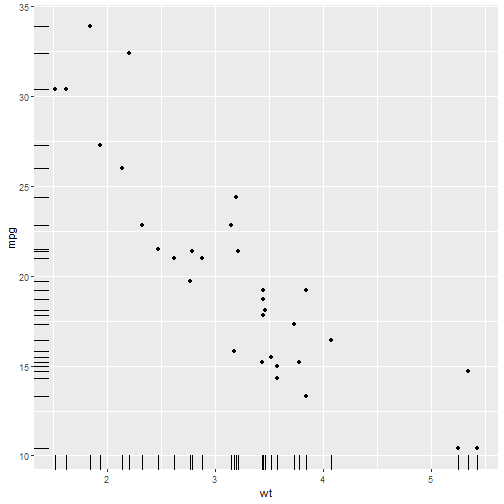
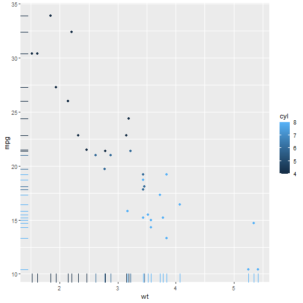
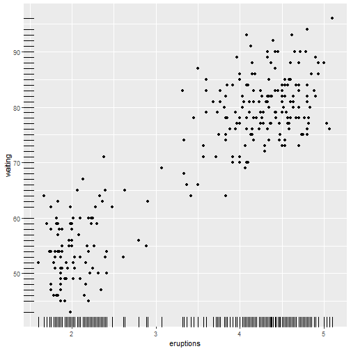

Developing Data Products - Course Project
========================================================
author: Vaibhav Chugh
date: 08/13/2021
autosize: true

Introduction
========================================================
This peer assessed assignment has two parts. First, you will create a Shiny application and deploy it on Rstudio's servers. Second, you will use Slidify or Rstudio Presenter to prepare a reproducible pitch presentation about your application.

Marking Criteria
========================================================
## Your Shiny Application

* Was there enough documentation on the shiny site for a user to get started using the application?
* Did the application run as described in the documentation?
* Was there some form of widget input (slider, textbox, radio buttons, checkbox, ...) in either ui.R or a custom web page?
* Did server.R perform some calculations on the input in server.R?
* Was the server calculation displayed in the html page?

## Your Reproducible Pitch

* Was the presentation completed in slidify or R Presenter?
* Was it 5 pages?
* Did it contain an R expression that got evaluated and displayed?
* Did it contain an R expression that got evaluated and displayed?
* Was it hosted on github or Rpubs?
* Was the server calculation displayed in the html page?

About the app
========================================================
We all love scatter plots. So I took this opportunity to provide an interface to the user to understand how scatter plots work,
by giving the ability to select x-range and y-range for both the axes which the user can set and see how it works.

Scatter plots: (https://en.wikipedia.org/wiki/Scatter_plot)[Learn more about]

Sources
========================================================

The github repo: (https://github.com/vaibhavchugh17/DevelopingDataProducts)[GitHub]

Shiny App Link: (https://vaibhavchugh17.shinyapps.io/C9P3/ )[App]
